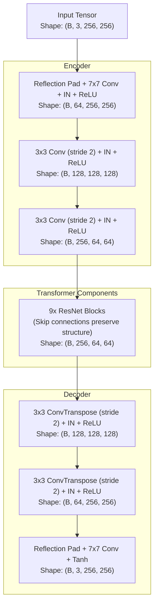
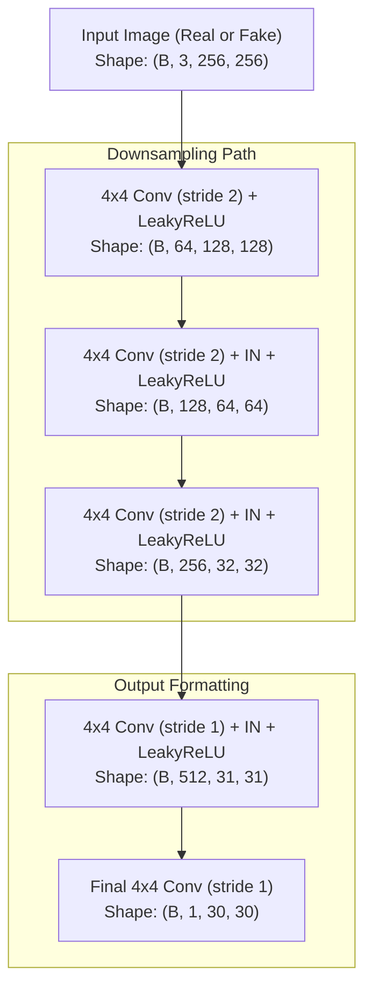
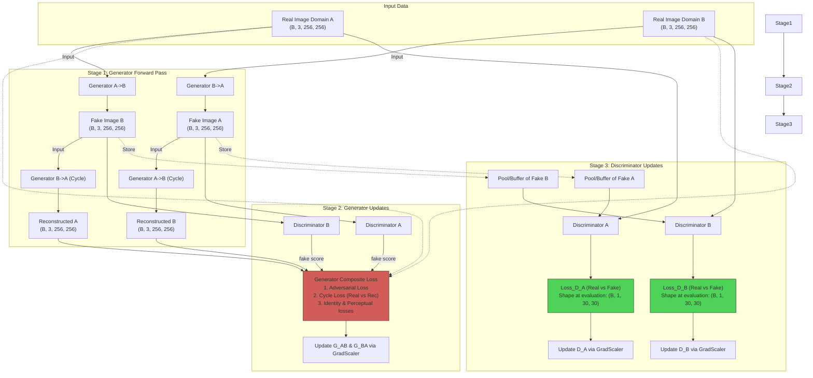

Listed directory project
Viewed generator.py:1-249
Viewed discriminator.py:1-147
Viewed training_loop.py:1-410

Here are the data flow and architecture diagrams for your CycleGAN's `generator.py`, `discriminator.py`, and `training_loop.py`. These visualize the tensor shapes at each critical transformation stage based on your PyTorch implementations.

### 1. Generator (`generator.py`)
This diagram shows the ResNet-based generator architecture which handles translation between domains while preserving structural features.

### 2. Discriminator (`discriminator.py`)
This is the PatchGAN architecture, evaluating whether overlapping patches of the image are real or generated.

> [!NOTE]
> The final output `(B, 1, 30, 30)` interprets a single probability score for each 70x70 receptive field location across the `256x256` image.

### 3. Training Loop (`training_loop.py`)
This details how data flows back and forth to compute differences in CycleGAN's composite losses, specifically noting adversarial and cycle combinations.

